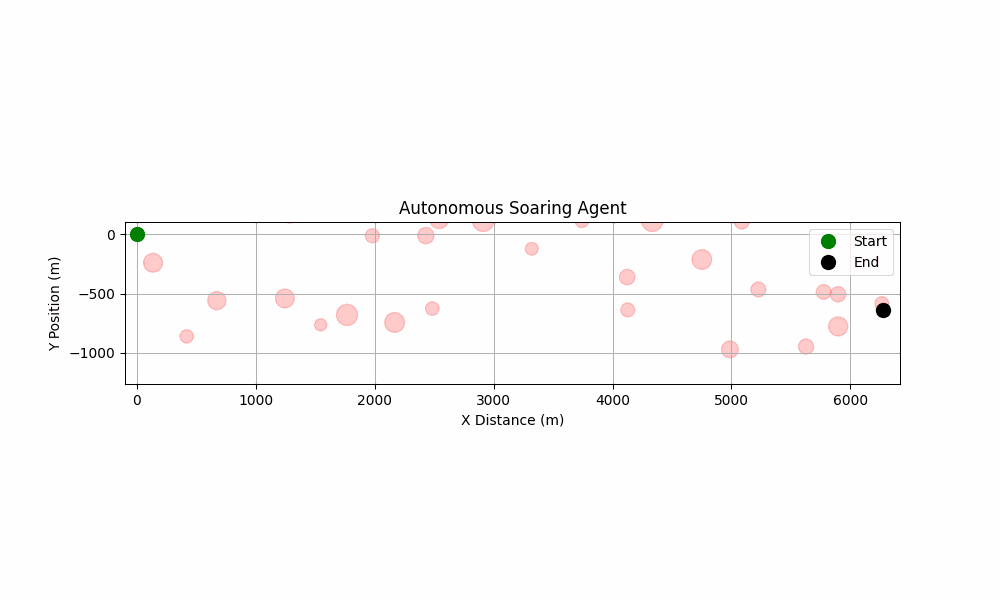

# Autonomous Glider Reinforcement Learning

This project, created for the course AE4350 at TU Delft, is an implementation of a reinforcement learning agent that learns the complex, bio-inspired skill of cross-country soaring. The agent is trained to pilot a simulated glider, intelligently utilizing procedurally generated thermal updrafts to maximize its travel distance.

The final agent was trained using a multi-stage **curriculum learning** approach, where it first mastered a simplified environment before being fine-tuned on a more challenging and realistic one. The resulting policy demonstrates sophisticated energy management, mimicking the "climb-and-glide" strategy of real-world soaring birds.


---

## Features

* **Advanced Soaring Environment:** A custom Gymnasium-compatible environment featuring a procedurally generated **"Zoned Gaussian Corridor"** of thermals. This ensures a consistent but non-repetitive challenge, forcing the agent to learn a general soaring strategy.
* **Intelligent Soaring Agent:** The agent, trained with Proximal Policy Optimization (PPO), learns a robust policy for cross-country flight. It demonstrates complex behaviors like pathfinding through thermal streets and managing its altitude to stay within a realistic flight envelope.
* **Gradual Curriculum Learning:** The training process is structured with a "difficulty knob" in the configuration. This allows the agent to first master the basics in an easy world before being gradually exposed to more difficult, realistic conditions, preventing catastrophic forgetting.
* **Detailed Evaluation:** A dedicated script (`evaluate.py`) for running statistical analysis over many episodes and generating high-quality visualizations of the agent's flight path and altitude profile.

---

## Installation

To set up and run this project locally, follow these steps.

**1. Clone the repository:**
```bash
git clone [https://github.com/](https://github.com/)[YourUsername]/[Your-Repo-Name].git
cd [Your-Repo-Name]
```

**2. Create and activate a virtual environment:**

* **Windows:**
    ```bash
    python -m venv .venv
    .\.venv\Scripts\activate
    ```
* **macOS / Linux:**
    ```bash
    python3 -m venv .venv
    source .venv/bin/activate
    ```

**3. Install the required dependencies:**
```bash
pip install -r requirements.txt
```

---

## Usage

This project uses a multi-stage curriculum learning approach for best results.

### Training

The training process is managed by the `DIFFICULTY` setting in `src/config.py`.

1.  **Phase 1 (Master the Basics):**
    * Open `src/config.py` and set `DIFFICULTY = 0.0`.
    * **Important:** Delete any existing model files in the `results/models/` directory to start fresh.
    * Run training until the agent's performance stabilizes at a high level:
        ```bash
        python src/train.py
        ```

2.  **Phase 2 (Fine-Tuning):**
    * Stop the training with `Ctrl+C`. The expert "easy mode" model will be saved.
    * In `src/config.py`, increase the difficulty to the next stage (e.g., `DIFFICULTY = 0.5`).
    * Run the training script again. It will automatically load the previously saved model and continue training (fine-tuning) in the harder environment.
    * Repeat this process, gradually increasing the difficulty to `1.0` for the final, most robust agent.

### Evaluation

To evaluate your trained agent and visualize its flight path:
```bash
python evaluate.py
```
This will print performance statistics averaged over 50 episodes and generate plots of a typical flight.

---

## Project Structure

The project is organized as follows:

```
├── src/
│   ├── glider_env.py     # The custom Gymnasium environment for the glider
│   ├── agent.py          # Creates the PPO agent structure
│   ├── train.py          # Main script to run the training process
│   ├── callback.py       # A simple callback for custom logging
│   └── config.py         # All project and training parameters
├── results/              # Output folder for models, logs, and plots
├── evaluate.py           # Script to evaluate a trained agent
├── .gitignore            # Files to be ignored by Git
├── requirements.txt      # Project dependencies
└── README.md             # You are here!
```

---

## License

This project is licensed under the MIT License. See the `LICENSE` file for details.
*(TODO: Create a file named `LICENSE` and add the MIT license text to it if you wish.)*